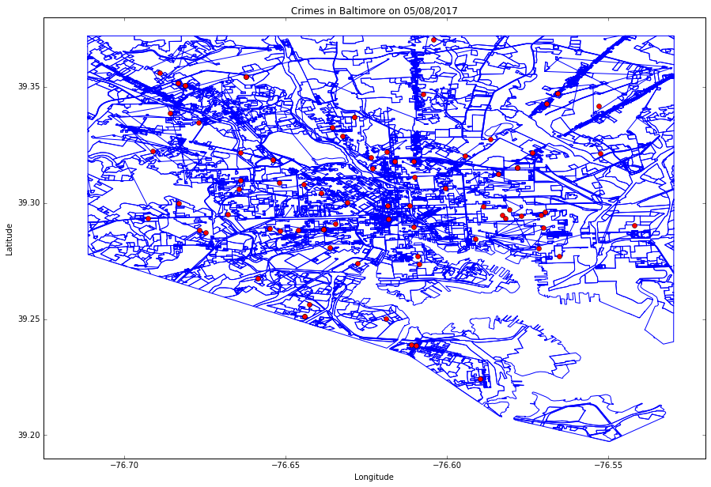

# Baltimore Victim Based Crime Data

Do the necessaries imports:


```python
%matplotlib inline

import numpy as np
# from matplotlib import pyplot as plt
import matplotlib.pyplot as plt
import pandas as pd

import shapefile as shp

from datetime import datetime
```


```python
from os import makedirs
from os.path import exists, isfile, getsize

# import urllib.request as urllib       # Python 2.7
from urllib.request import urlretrieve  # Python 3
```

If the temporaries directories don't exist, so create them:


```python
path_of_folders = ["files/data/", "files/shp/"]

for path_of_folder in path_of_folders:
    if not exists(path_of_folder):
        makedirs(path_of_folder)
```

# Download the ShapeFile and CSV data

Download the CSV data from https://data.baltimorecity.gov/Public-Safety/BPD-Part-1-Victim-Based-Crime-Data/wsfq-mvij


```python
based_crime_data_csv = "files/data/Based_Crime_Data.csv"
```


```python
vendors = "https://data.baltimorecity.gov/api/views/wsfq-mvij/rows.csv?accessType=DOWNLOAD"

# download the file
# urlretrieve(vendors, based_crime_data_csv)

if isfile(based_crime_data_csv):
    tam = getsize(based_crime_data_csv)
    print("File downloaded, ", tam, " bytes.")
else:
    print("Error downloading file!")
```

    File downloaded,  40538138  bytes.


Download the ShapeFile of Baltimore from https://data.baltimorecity.gov/Geographic/Land-use-Shape/feax-3ycj


```python
shape_file_data = "files/shp/landuse.zip"
```


```python
shape_file_zip = "https://data.baltimorecity.gov/api/views/feax-3ycj/files/hMHrtD_9UtnfKw47cqs_2RYH9ZXET7TlpW4V4_4A_IE?filename=Landuse.zip"

# download the file
# urlretrieve(shape_file_zip, shape_file_data)

if isfile(shape_file_data):
    tam = getsize(based_crime_data_csv)
    print("File downloaded, ", tam, " bytes.")
else:
    print("Error downloading file!")
```

    File downloaded,  40538138  bytes.


The projection of the points in dataframe is WGS84 (EPSG:4326) and the shapefile of Baltimore I have no idea... So I used the QGIS to reproject the shapefile to WGS84 (EPSG:4326)

# Read the CSV data

Read the CSV keeping the same header and change the Location.1 column to location from df_crimes:


```python
df_crimes = pd.read_csv(based_crime_data_csv)

df_crimes = df_crimes.rename(columns={"Location 1": "Location"})

df_crimes.head()
```


<div>
<style>
    .dataframe thead tr:only-child th {
        text-align: right;
    }

    .dataframe thead th {
        text-align: left;
    }

    .dataframe tbody tr th {
        vertical-align: top;
    }
</style>
<table border="1" class="dataframe">
  <thead>
    <tr style="text-align: right;">
      <th></th>
      <th>CrimeDate</th>
      <th>CrimeTime</th>
      <th>CrimeCode</th>
      <th>Location</th>
      <th>Description</th>
      <th>Inside/Outside</th>
      <th>Weapon</th>
      <th>Post</th>
      <th>District</th>
      <th>Neighborhood</th>
      <th>Longitude</th>
      <th>Latitude</th>
      <th>Location</th>
      <th>Premise</th>
      <th>Total Incidents</th>
    </tr>
  </thead>
  <tbody>
    <tr>
      <th>0</th>
      <td>08/05/2017</td>
      <td>23:00:00</td>
      <td>6D</td>
      <td>PARK DR &amp; LIBERTY HEIGHTS AV</td>
      <td>LARCENY FROM AUTO</td>
      <td>O</td>
      <td>NaN</td>
      <td>611.0</td>
      <td>NORTHWESTERN</td>
      <td>Burleith-Leighton</td>
      <td>-76.66388</td>
      <td>39.32183</td>
      <td>(39.3218300000, -76.6638800000)</td>
      <td>STREET</td>
      <td>1</td>
    </tr>
    <tr>
      <th>1</th>
      <td>08/05/2017</td>
      <td>23:00:00</td>
      <td>4E</td>
      <td>2100 WESTWOOD AVE</td>
      <td>COMMON ASSAULT</td>
      <td>O</td>
      <td>HANDS</td>
      <td>741.0</td>
      <td>WESTERN</td>
      <td>Easterwood</td>
      <td>-76.65191</td>
      <td>39.30862</td>
      <td>(39.3086200000, -76.6519100000)</td>
      <td>STREET</td>
      <td>1</td>
    </tr>
    <tr>
      <th>2</th>
      <td>08/05/2017</td>
      <td>21:57:00</td>
      <td>1F</td>
      <td>1600 GERTRUDE ST</td>
      <td>HOMICIDE</td>
      <td>Outside</td>
      <td>FIREARM</td>
      <td>813.0</td>
      <td>SOUTHWESTERN</td>
      <td>Northwest Community Actio</td>
      <td>-76.66456</td>
      <td>39.30605</td>
      <td>(39.3060500000, -76.6645600000)</td>
      <td>Street</td>
      <td>1</td>
    </tr>
    <tr>
      <th>3</th>
      <td>08/05/2017</td>
      <td>21:00:00</td>
      <td>4E</td>
      <td>1300 PENNSYLVANIA AVE</td>
      <td>COMMON ASSAULT</td>
      <td>I</td>
      <td>HANDS</td>
      <td>123.0</td>
      <td>CENTRAL</td>
      <td>Upton</td>
      <td>-76.63080</td>
      <td>39.30039</td>
      <td>(39.3003900000, -76.6308000000)</td>
      <td>APT/CONDO</td>
      <td>1</td>
    </tr>
    <tr>
      <th>4</th>
      <td>08/05/2017</td>
      <td>20:44:00</td>
      <td>6C</td>
      <td>3600 W CATON AVE</td>
      <td>LARCENY</td>
      <td>I</td>
      <td>NaN</td>
      <td>843.0</td>
      <td>SOUTHWESTERN</td>
      <td>Allendale</td>
      <td>-76.67669</td>
      <td>39.28833</td>
      <td>(39.2883300000, -76.6766900000)</td>
      <td>GROCERY/CO</td>
      <td>1</td>
    </tr>
  </tbody>
</table>
</div>


Describe the dataframe:


```python
df_crimes.describe()
```


<div>
<style>
    .dataframe thead tr:only-child th {
        text-align: right;
    }

    .dataframe thead th {
        text-align: left;
    }

    .dataframe tbody tr th {
        vertical-align: top;
    }
</style>
<table border="1" class="dataframe">
  <thead>
    <tr style="text-align: right;">
      <th></th>
      <th>Post</th>
      <th>Longitude</th>
      <th>Latitude</th>
      <th>Total Incidents</th>
    </tr>
  </thead>
  <tbody>
    <tr>
      <th>count</th>
      <td>272025.000000</td>
      <td>270081.000000</td>
      <td>270081.000000</td>
      <td>272252.0</td>
    </tr>
    <tr>
      <th>mean</th>
      <td>506.183288</td>
      <td>-76.617435</td>
      <td>39.307419</td>
      <td>1.0</td>
    </tr>
    <tr>
      <th>std</th>
      <td>260.701478</td>
      <td>0.042297</td>
      <td>0.029545</td>
      <td>0.0</td>
    </tr>
    <tr>
      <th>min</th>
      <td>2.000000</td>
      <td>-76.711620</td>
      <td>39.200410</td>
      <td>1.0</td>
    </tr>
    <tr>
      <th>25%</th>
      <td>243.000000</td>
      <td>-76.648430</td>
      <td>39.288350</td>
      <td>1.0</td>
    </tr>
    <tr>
      <th>50%</th>
      <td>511.000000</td>
      <td>-76.613970</td>
      <td>39.303660</td>
      <td>1.0</td>
    </tr>
    <tr>
      <th>75%</th>
      <td>731.000000</td>
      <td>-76.587450</td>
      <td>39.327810</td>
      <td>1.0</td>
    </tr>
    <tr>
      <th>max</th>
      <td>945.000000</td>
      <td>-76.528500</td>
      <td>39.372930</td>
      <td>1.0</td>
    </tr>
  </tbody>
</table>
</div>


Information about the dataframe:


```python
df_crimes.info()
```

    <class 'pandas.core.frame.DataFrame'>
    RangeIndex: 272252 entries, 0 to 272251
    Data columns (total 15 columns):
    CrimeDate          272252 non-null object
    CrimeTime          272252 non-null object
    CrimeCode          272252 non-null object
    Location           270078 non-null object
    Description        272252 non-null object
    Inside/Outside     262667 non-null object
    Weapon             93951 non-null object
    Post               272025 non-null float64
    District           272170 non-null object
    Neighborhood       269553 non-null object
    Longitude          270081 non-null float64
    Latitude           270081 non-null float64
    Location           270081 non-null object
    Premise            262189 non-null object
    Total Incidents    272252 non-null int64
    dtypes: float64(3), int64(1), object(11)
    memory usage: 31.2+ MB


Do a copy of dataframe:


```python
df_crimes_cp = df_crimes.copy()
```

# Convert the date in string to datetime

Create a new column called CrimeDateTime with the date in datetime:


```python
df_crimes_cp['CrimeDateTime'] = pd.to_datetime(df_crimes_cp['CrimeDate'])

df_crimes_cp.head()
```


<div>
<style>
    .dataframe thead tr:only-child th {
        text-align: right;
    }

    .dataframe thead th {
        text-align: left;
    }

    .dataframe tbody tr th {
        vertical-align: top;
    }
</style>
<table border="1" class="dataframe">
  <thead>
    <tr style="text-align: right;">
      <th></th>
      <th>CrimeDate</th>
      <th>CrimeTime</th>
      <th>CrimeCode</th>
      <th>Location</th>
      <th>Description</th>
      <th>Inside/Outside</th>
      <th>Weapon</th>
      <th>Post</th>
      <th>District</th>
      <th>Neighborhood</th>
      <th>Longitude</th>
      <th>Latitude</th>
      <th>Location</th>
      <th>Premise</th>
      <th>Total Incidents</th>
      <th>CrimeDateTime</th>
    </tr>
  </thead>
  <tbody>
    <tr>
      <th>0</th>
      <td>08/05/2017</td>
      <td>23:00:00</td>
      <td>6D</td>
      <td>PARK DR &amp; LIBERTY HEIGHTS AV</td>
      <td>LARCENY FROM AUTO</td>
      <td>O</td>
      <td>NaN</td>
      <td>611.0</td>
      <td>NORTHWESTERN</td>
      <td>Burleith-Leighton</td>
      <td>-76.66388</td>
      <td>39.32183</td>
      <td>(39.3218300000, -76.6638800000)</td>
      <td>STREET</td>
      <td>1</td>
      <td>2017-08-05</td>
    </tr>
    <tr>
      <th>1</th>
      <td>08/05/2017</td>
      <td>23:00:00</td>
      <td>4E</td>
      <td>2100 WESTWOOD AVE</td>
      <td>COMMON ASSAULT</td>
      <td>O</td>
      <td>HANDS</td>
      <td>741.0</td>
      <td>WESTERN</td>
      <td>Easterwood</td>
      <td>-76.65191</td>
      <td>39.30862</td>
      <td>(39.3086200000, -76.6519100000)</td>
      <td>STREET</td>
      <td>1</td>
      <td>2017-08-05</td>
    </tr>
    <tr>
      <th>2</th>
      <td>08/05/2017</td>
      <td>21:57:00</td>
      <td>1F</td>
      <td>1600 GERTRUDE ST</td>
      <td>HOMICIDE</td>
      <td>Outside</td>
      <td>FIREARM</td>
      <td>813.0</td>
      <td>SOUTHWESTERN</td>
      <td>Northwest Community Actio</td>
      <td>-76.66456</td>
      <td>39.30605</td>
      <td>(39.3060500000, -76.6645600000)</td>
      <td>Street</td>
      <td>1</td>
      <td>2017-08-05</td>
    </tr>
    <tr>
      <th>3</th>
      <td>08/05/2017</td>
      <td>21:00:00</td>
      <td>4E</td>
      <td>1300 PENNSYLVANIA AVE</td>
      <td>COMMON ASSAULT</td>
      <td>I</td>
      <td>HANDS</td>
      <td>123.0</td>
      <td>CENTRAL</td>
      <td>Upton</td>
      <td>-76.63080</td>
      <td>39.30039</td>
      <td>(39.3003900000, -76.6308000000)</td>
      <td>APT/CONDO</td>
      <td>1</td>
      <td>2017-08-05</td>
    </tr>
    <tr>
      <th>4</th>
      <td>08/05/2017</td>
      <td>20:44:00</td>
      <td>6C</td>
      <td>3600 W CATON AVE</td>
      <td>LARCENY</td>
      <td>I</td>
      <td>NaN</td>
      <td>843.0</td>
      <td>SOUTHWESTERN</td>
      <td>Allendale</td>
      <td>-76.67669</td>
      <td>39.28833</td>
      <td>(39.2883300000, -76.6766900000)</td>
      <td>GROCERY/CO</td>
      <td>1</td>
      <td>2017-08-05</td>
    </tr>
  </tbody>
</table>
</div>


The column CrimeDateTime is in the end, so... we will reorder the columns:


```python
# get the list of columns
cols = df_crimes_cp.columns.tolist()
# put the last column as first column
cols = cols[-1:] + cols[:-1]
# reorder the columns
df_crimes_cp = df_crimes_cp[cols]

df_crimes_cp.head()
```


<div>
<style>
    .dataframe thead tr:only-child th {
        text-align: right;
    }

    .dataframe thead th {
        text-align: left;
    }

    .dataframe tbody tr th {
        vertical-align: top;
    }
</style>
<table border="1" class="dataframe">
  <thead>
    <tr style="text-align: right;">
      <th></th>
      <th>CrimeDateTime</th>
      <th>CrimeDate</th>
      <th>CrimeTime</th>
      <th>CrimeCode</th>
      <th>Location</th>
      <th>Location</th>
      <th>Description</th>
      <th>Inside/Outside</th>
      <th>Weapon</th>
      <th>Post</th>
      <th>District</th>
      <th>Neighborhood</th>
      <th>Longitude</th>
      <th>Latitude</th>
      <th>Location</th>
      <th>Location</th>
      <th>Premise</th>
      <th>Total Incidents</th>
    </tr>
  </thead>
  <tbody>
    <tr>
      <th>0</th>
      <td>2017-08-05</td>
      <td>08/05/2017</td>
      <td>23:00:00</td>
      <td>6D</td>
      <td>PARK DR &amp; LIBERTY HEIGHTS AV</td>
      <td>(39.3218300000, -76.6638800000)</td>
      <td>LARCENY FROM AUTO</td>
      <td>O</td>
      <td>NaN</td>
      <td>611.0</td>
      <td>NORTHWESTERN</td>
      <td>Burleith-Leighton</td>
      <td>-76.66388</td>
      <td>39.32183</td>
      <td>PARK DR &amp; LIBERTY HEIGHTS AV</td>
      <td>(39.3218300000, -76.6638800000)</td>
      <td>STREET</td>
      <td>1</td>
    </tr>
    <tr>
      <th>1</th>
      <td>2017-08-05</td>
      <td>08/05/2017</td>
      <td>23:00:00</td>
      <td>4E</td>
      <td>2100 WESTWOOD AVE</td>
      <td>(39.3086200000, -76.6519100000)</td>
      <td>COMMON ASSAULT</td>
      <td>O</td>
      <td>HANDS</td>
      <td>741.0</td>
      <td>WESTERN</td>
      <td>Easterwood</td>
      <td>-76.65191</td>
      <td>39.30862</td>
      <td>2100 WESTWOOD AVE</td>
      <td>(39.3086200000, -76.6519100000)</td>
      <td>STREET</td>
      <td>1</td>
    </tr>
    <tr>
      <th>2</th>
      <td>2017-08-05</td>
      <td>08/05/2017</td>
      <td>21:57:00</td>
      <td>1F</td>
      <td>1600 GERTRUDE ST</td>
      <td>(39.3060500000, -76.6645600000)</td>
      <td>HOMICIDE</td>
      <td>Outside</td>
      <td>FIREARM</td>
      <td>813.0</td>
      <td>SOUTHWESTERN</td>
      <td>Northwest Community Actio</td>
      <td>-76.66456</td>
      <td>39.30605</td>
      <td>1600 GERTRUDE ST</td>
      <td>(39.3060500000, -76.6645600000)</td>
      <td>Street</td>
      <td>1</td>
    </tr>
    <tr>
      <th>3</th>
      <td>2017-08-05</td>
      <td>08/05/2017</td>
      <td>21:00:00</td>
      <td>4E</td>
      <td>1300 PENNSYLVANIA AVE</td>
      <td>(39.3003900000, -76.6308000000)</td>
      <td>COMMON ASSAULT</td>
      <td>I</td>
      <td>HANDS</td>
      <td>123.0</td>
      <td>CENTRAL</td>
      <td>Upton</td>
      <td>-76.63080</td>
      <td>39.30039</td>
      <td>1300 PENNSYLVANIA AVE</td>
      <td>(39.3003900000, -76.6308000000)</td>
      <td>APT/CONDO</td>
      <td>1</td>
    </tr>
    <tr>
      <th>4</th>
      <td>2017-08-05</td>
      <td>08/05/2017</td>
      <td>20:44:00</td>
      <td>6C</td>
      <td>3600 W CATON AVE</td>
      <td>(39.2883300000, -76.6766900000)</td>
      <td>LARCENY</td>
      <td>I</td>
      <td>NaN</td>
      <td>843.0</td>
      <td>SOUTHWESTERN</td>
      <td>Allendale</td>
      <td>-76.67669</td>
      <td>39.28833</td>
      <td>3600 W CATON AVE</td>
      <td>(39.2883300000, -76.6766900000)</td>
      <td>GROCERY/CO</td>
      <td>1</td>
    </tr>
  </tbody>
</table>
</div>


Get all crimes on the following date:


```python
date = datetime(2017, 8, 5)

df_crimes_in_date = df_crimes_cp[df_crimes_cp.CrimeDateTime == date]

df_crimes_in_date.info()
```

    <class 'pandas.core.frame.DataFrame'>
    Int64Index: 83 entries, 0 to 83
    Data columns (total 18 columns):
    CrimeDateTime      83 non-null datetime64[ns]
    CrimeDate          83 non-null object
    CrimeTime          83 non-null object
    CrimeCode          83 non-null object
    Location           83 non-null object
    Location           83 non-null object
    Description        83 non-null object
    Inside/Outside     75 non-null object
    Weapon             41 non-null object
    Post               83 non-null float64
    District           83 non-null object
    Neighborhood       83 non-null object
    Longitude          83 non-null float64
    Latitude           83 non-null float64
    Location           83 non-null object
    Location           83 non-null object
    Premise            75 non-null object
    Total Incidents    83 non-null int64
    dtypes: datetime64[ns](1), float64(3), int64(1), object(13)
    memory usage: 12.3+ KB


# Plot the data

We will plot the shapefile of Baltimore. First load the shapefile:


```python
shpFilePath = "/media/rodrigo/blue_white/f/INPE/mestrado/2017/p2/intro_data_science/projeto/crimes_baltimore/files/shp/landuse_4326/landuse_4326.shp"  

sf = shp.Reader(shpFilePath)
```

Plot the shapefile with the point of crimes:


```python
# settings of the plot
plt.figure(figsize=(15,10))  # image size
plt.axis([-76.725, -76.52, 39.19, 39.38])  # axis
plt.title('Crimes in Baltimore on ' + str(date.date().strftime("%d/%m/%Y")))
plt.xlabel('Longitude')
plt.ylabel('Latitude')


# put the shapefile on plot
for shape in sf.shapeRecords():
    x = [i[0] for i in shape.shape.points[:]]
    y = [i[1] for i in shape.shape.points[:]]
    plt.plot(x, y, 'b')  # b - blue

# Get the x (Longitude) and y (Latitude) values
# Put the points of crimes on plot
x = np.array(list(df_crimes_in_date["Longitude"]))
y = np.array(list(df_crimes_in_date["Latitude"]))
plt.plot(x, y, 'ro')  # r - red , o - circle


# save and show the plot
# plt.savefig('baltimore_4326.png')
plt.show()
```





More information about Pandas: https://pandas.pydata.org/pandas-docs/stable/10min.html


```python

```
