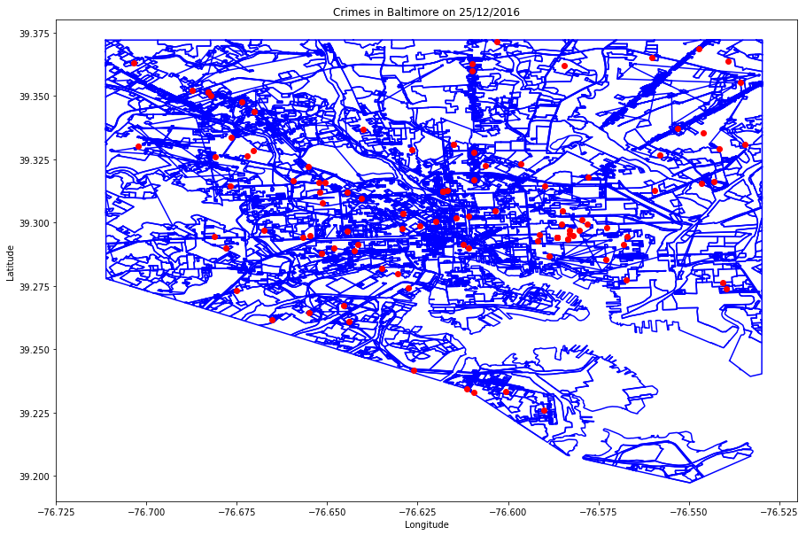
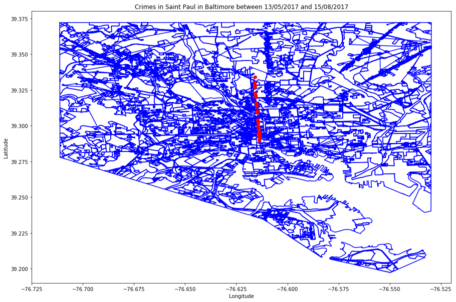

# Baltimore Victim Based Crime Data

Do the necessaries imports:


```python
%matplotlib inline

import numpy as np
# from matplotlib import pyplot as plt
import matplotlib.pyplot as plt
import pandas as pd

import shapefile as shp

from datetime import datetime
```


```python
from os import makedirs
from os.path import exists, isfile, getsize

# import urllib.request as urllib       # Python 2.7
from urllib.request import urlretrieve  # Python 3
```

If the temporaries directories don't exist, so create them:


```python
path_of_folders = ["files/data/", "files/shp/"]

for path_of_folder in path_of_folders:
    if not exists(path_of_folder):
        makedirs(path_of_folder)
```

# Download the ShapeFile and CSV data

Download the CSV data from https://data.baltimorecity.gov/Public-Safety/BPD-Part-1-Victim-Based-Crime-Data/wsfq-mvij


```python
based_crime_data_data = "files/data/Based_Crime_Data.csv"
```


```python
based_crime_data_csv = "https://data.baltimorecity.gov/api/views/wsfq-mvij/rows.csv?accessType=DOWNLOAD"

# download the file
# urlretrieve(based_crime_data_csv, based_crime_data_csv)

if isfile(based_crime_data_data):
    tam = getsize(based_crime_data_data)
    print("File downloaded, ", tam, " bytes.")
else:
    print("Error downloading file!")
```

    File downloaded,  40538138  bytes.


Download the ShapeFile of Baltimore from https://data.baltimorecity.gov/Geographic/Land-use-Shape/feax-3ycj


```python
shape_file_data = "files/shp/landuse.zip"
```


```python
shape_file_zip = "https://data.baltimorecity.gov/api/views/feax-3ycj/files/hMHrtD_9UtnfKw47cqs_2RYH9ZXET7TlpW4V4_4A_IE?filename=Landuse.zip"

# download the file
# urlretrieve(shape_file_zip, shape_file_data)

if isfile(shape_file_data):
    tam = getsize(shape_file_data)
    print("File downloaded, ", tam, " bytes.")
else:
    print("Error downloading file!")
```

    File downloaded,  3709817  bytes.


The projection of the points in dataframe is WGS84 (EPSG:4326) and the shapefile of Baltimore I have no idea... So I used the QGIS to reproject the shapefile to WGS84 (EPSG:4326)

# Read the ShapeFile and CSV data

Load the shapefile to use it in the future:


```python
shape_file_path = "files/shp/landuse_4326/landuse_4326.shp"  

shape_file = shp.Reader(shape_file_path)
```

Read the CSV keeping the same header and change the Location.1 column to location from df_crimes:


```python
df_crimes = pd.read_csv(based_crime_data_data)

df_crimes = df_crimes.rename(columns={"Location 1": "Lat_Long"})

df_crimes.head()
```


<div>
<style>
    .dataframe thead tr:only-child th {
        text-align: right;
    }

    .dataframe thead th {
        text-align: left;
    }

    .dataframe tbody tr th {
        vertical-align: top;
    }
</style>
<table border="1" class="dataframe">
  <thead>
    <tr style="text-align: right;">
      <th></th>
      <th>CrimeDate</th>
      <th>CrimeTime</th>
      <th>CrimeCode</th>
      <th>Location</th>
      <th>Description</th>
      <th>Inside/Outside</th>
      <th>Weapon</th>
      <th>Post</th>
      <th>District</th>
      <th>Neighborhood</th>
      <th>Longitude</th>
      <th>Latitude</th>
      <th>Lat_Long</th>
      <th>Premise</th>
      <th>Total Incidents</th>
    </tr>
  </thead>
  <tbody>
    <tr>
      <th>0</th>
      <td>08/05/2017</td>
      <td>23:00:00</td>
      <td>6D</td>
      <td>PARK DR &amp; LIBERTY HEIGHTS AV</td>
      <td>LARCENY FROM AUTO</td>
      <td>O</td>
      <td>NaN</td>
      <td>611.0</td>
      <td>NORTHWESTERN</td>
      <td>Burleith-Leighton</td>
      <td>-76.66388</td>
      <td>39.32183</td>
      <td>(39.3218300000, -76.6638800000)</td>
      <td>STREET</td>
      <td>1</td>
    </tr>
    <tr>
      <th>1</th>
      <td>08/05/2017</td>
      <td>23:00:00</td>
      <td>4E</td>
      <td>2100 WESTWOOD AVE</td>
      <td>COMMON ASSAULT</td>
      <td>O</td>
      <td>HANDS</td>
      <td>741.0</td>
      <td>WESTERN</td>
      <td>Easterwood</td>
      <td>-76.65191</td>
      <td>39.30862</td>
      <td>(39.3086200000, -76.6519100000)</td>
      <td>STREET</td>
      <td>1</td>
    </tr>
    <tr>
      <th>2</th>
      <td>08/05/2017</td>
      <td>21:57:00</td>
      <td>1F</td>
      <td>1600 GERTRUDE ST</td>
      <td>HOMICIDE</td>
      <td>Outside</td>
      <td>FIREARM</td>
      <td>813.0</td>
      <td>SOUTHWESTERN</td>
      <td>Northwest Community Actio</td>
      <td>-76.66456</td>
      <td>39.30605</td>
      <td>(39.3060500000, -76.6645600000)</td>
      <td>Street</td>
      <td>1</td>
    </tr>
    <tr>
      <th>3</th>
      <td>08/05/2017</td>
      <td>21:00:00</td>
      <td>4E</td>
      <td>1300 PENNSYLVANIA AVE</td>
      <td>COMMON ASSAULT</td>
      <td>I</td>
      <td>HANDS</td>
      <td>123.0</td>
      <td>CENTRAL</td>
      <td>Upton</td>
      <td>-76.63080</td>
      <td>39.30039</td>
      <td>(39.3003900000, -76.6308000000)</td>
      <td>APT/CONDO</td>
      <td>1</td>
    </tr>
    <tr>
      <th>4</th>
      <td>08/05/2017</td>
      <td>20:44:00</td>
      <td>6C</td>
      <td>3600 W CATON AVE</td>
      <td>LARCENY</td>
      <td>I</td>
      <td>NaN</td>
      <td>843.0</td>
      <td>SOUTHWESTERN</td>
      <td>Allendale</td>
      <td>-76.67669</td>
      <td>39.28833</td>
      <td>(39.2883300000, -76.6766900000)</td>
      <td>GROCERY/CO</td>
      <td>1</td>
    </tr>
  </tbody>
</table>
</div>


Describe the dataframe:


```python
df_crimes.describe()
```


<div>
<style>
    .dataframe thead tr:only-child th {
        text-align: right;
    }

    .dataframe thead th {
        text-align: left;
    }

    .dataframe tbody tr th {
        vertical-align: top;
    }
</style>
<table border="1" class="dataframe">
  <thead>
    <tr style="text-align: right;">
      <th></th>
      <th>Post</th>
      <th>Longitude</th>
      <th>Latitude</th>
      <th>Total Incidents</th>
    </tr>
  </thead>
  <tbody>
    <tr>
      <th>count</th>
      <td>272025.000000</td>
      <td>270081.000000</td>
      <td>270081.000000</td>
      <td>272252.0</td>
    </tr>
    <tr>
      <th>mean</th>
      <td>506.183288</td>
      <td>-76.617435</td>
      <td>39.307419</td>
      <td>1.0</td>
    </tr>
    <tr>
      <th>std</th>
      <td>260.701478</td>
      <td>0.042297</td>
      <td>0.029545</td>
      <td>0.0</td>
    </tr>
    <tr>
      <th>min</th>
      <td>2.000000</td>
      <td>-76.711620</td>
      <td>39.200410</td>
      <td>1.0</td>
    </tr>
    <tr>
      <th>25%</th>
      <td>243.000000</td>
      <td>-76.648430</td>
      <td>39.288350</td>
      <td>1.0</td>
    </tr>
    <tr>
      <th>50%</th>
      <td>511.000000</td>
      <td>-76.613970</td>
      <td>39.303660</td>
      <td>1.0</td>
    </tr>
    <tr>
      <th>75%</th>
      <td>731.000000</td>
      <td>-76.587450</td>
      <td>39.327810</td>
      <td>1.0</td>
    </tr>
    <tr>
      <th>max</th>
      <td>945.000000</td>
      <td>-76.528500</td>
      <td>39.372930</td>
      <td>1.0</td>
    </tr>
  </tbody>
</table>
</div>


Information about the dataframe:


```python
df_crimes.info()
```

    <class 'pandas.core.frame.DataFrame'>
    RangeIndex: 272252 entries, 0 to 272251
    Data columns (total 15 columns):
    CrimeDate          272252 non-null object
    CrimeTime          272252 non-null object
    CrimeCode          272252 non-null object
    Location           270078 non-null object
    Description        272252 non-null object
    Inside/Outside     262667 non-null object
    Weapon             93951 non-null object
    Post               272025 non-null float64
    District           272170 non-null object
    Neighborhood       269553 non-null object
    Longitude          270081 non-null float64
    Latitude           270081 non-null float64
    Lat_Long           270081 non-null object
    Premise            262189 non-null object
    Total Incidents    272252 non-null int64
    dtypes: float64(3), int64(1), object(11)
    memory usage: 31.2+ MB


Do a copy of dataframe:


```python
df_crimes_cp = df_crimes.copy()
```

# Convert the date in string to datetime

Create a new column called CrimeDateTime with the date in datetime:


```python
df_crimes_cp['CrimeDateTime'] = pd.to_datetime(df_crimes_cp['CrimeDate'])

df_crimes_cp.head()
```


<div>
<style>
    .dataframe thead tr:only-child th {
        text-align: right;
    }

    .dataframe thead th {
        text-align: left;
    }

    .dataframe tbody tr th {
        vertical-align: top;
    }
</style>
<table border="1" class="dataframe">
  <thead>
    <tr style="text-align: right;">
      <th></th>
      <th>CrimeDate</th>
      <th>CrimeTime</th>
      <th>CrimeCode</th>
      <th>Location</th>
      <th>Description</th>
      <th>Inside/Outside</th>
      <th>Weapon</th>
      <th>Post</th>
      <th>District</th>
      <th>Neighborhood</th>
      <th>Longitude</th>
      <th>Latitude</th>
      <th>Lat_Long</th>
      <th>Premise</th>
      <th>Total Incidents</th>
      <th>CrimeDateTime</th>
    </tr>
  </thead>
  <tbody>
    <tr>
      <th>0</th>
      <td>08/05/2017</td>
      <td>23:00:00</td>
      <td>6D</td>
      <td>PARK DR &amp; LIBERTY HEIGHTS AV</td>
      <td>LARCENY FROM AUTO</td>
      <td>O</td>
      <td>NaN</td>
      <td>611.0</td>
      <td>NORTHWESTERN</td>
      <td>Burleith-Leighton</td>
      <td>-76.66388</td>
      <td>39.32183</td>
      <td>(39.3218300000, -76.6638800000)</td>
      <td>STREET</td>
      <td>1</td>
      <td>2017-08-05</td>
    </tr>
    <tr>
      <th>1</th>
      <td>08/05/2017</td>
      <td>23:00:00</td>
      <td>4E</td>
      <td>2100 WESTWOOD AVE</td>
      <td>COMMON ASSAULT</td>
      <td>O</td>
      <td>HANDS</td>
      <td>741.0</td>
      <td>WESTERN</td>
      <td>Easterwood</td>
      <td>-76.65191</td>
      <td>39.30862</td>
      <td>(39.3086200000, -76.6519100000)</td>
      <td>STREET</td>
      <td>1</td>
      <td>2017-08-05</td>
    </tr>
    <tr>
      <th>2</th>
      <td>08/05/2017</td>
      <td>21:57:00</td>
      <td>1F</td>
      <td>1600 GERTRUDE ST</td>
      <td>HOMICIDE</td>
      <td>Outside</td>
      <td>FIREARM</td>
      <td>813.0</td>
      <td>SOUTHWESTERN</td>
      <td>Northwest Community Actio</td>
      <td>-76.66456</td>
      <td>39.30605</td>
      <td>(39.3060500000, -76.6645600000)</td>
      <td>Street</td>
      <td>1</td>
      <td>2017-08-05</td>
    </tr>
    <tr>
      <th>3</th>
      <td>08/05/2017</td>
      <td>21:00:00</td>
      <td>4E</td>
      <td>1300 PENNSYLVANIA AVE</td>
      <td>COMMON ASSAULT</td>
      <td>I</td>
      <td>HANDS</td>
      <td>123.0</td>
      <td>CENTRAL</td>
      <td>Upton</td>
      <td>-76.63080</td>
      <td>39.30039</td>
      <td>(39.3003900000, -76.6308000000)</td>
      <td>APT/CONDO</td>
      <td>1</td>
      <td>2017-08-05</td>
    </tr>
    <tr>
      <th>4</th>
      <td>08/05/2017</td>
      <td>20:44:00</td>
      <td>6C</td>
      <td>3600 W CATON AVE</td>
      <td>LARCENY</td>
      <td>I</td>
      <td>NaN</td>
      <td>843.0</td>
      <td>SOUTHWESTERN</td>
      <td>Allendale</td>
      <td>-76.67669</td>
      <td>39.28833</td>
      <td>(39.2883300000, -76.6766900000)</td>
      <td>GROCERY/CO</td>
      <td>1</td>
      <td>2017-08-05</td>
    </tr>
  </tbody>
</table>
</div>


The column CrimeDateTime is in the end, so... we will reorder the columns:


```python
# get the list of columns
cols = df_crimes_cp.columns.tolist()
# put the last column as first column
cols = cols[-1:] + cols[:-1]
# reorder the columns
df_crimes_cp = df_crimes_cp[cols]

df_crimes_cp.head()
```


<div>
<style>
    .dataframe thead tr:only-child th {
        text-align: right;
    }

    .dataframe thead th {
        text-align: left;
    }

    .dataframe tbody tr th {
        vertical-align: top;
    }
</style>
<table border="1" class="dataframe">
  <thead>
    <tr style="text-align: right;">
      <th></th>
      <th>CrimeDateTime</th>
      <th>CrimeDate</th>
      <th>CrimeTime</th>
      <th>CrimeCode</th>
      <th>Location</th>
      <th>Description</th>
      <th>Inside/Outside</th>
      <th>Weapon</th>
      <th>Post</th>
      <th>District</th>
      <th>Neighborhood</th>
      <th>Longitude</th>
      <th>Latitude</th>
      <th>Lat_Long</th>
      <th>Premise</th>
      <th>Total Incidents</th>
    </tr>
  </thead>
  <tbody>
    <tr>
      <th>0</th>
      <td>2017-08-05</td>
      <td>08/05/2017</td>
      <td>23:00:00</td>
      <td>6D</td>
      <td>PARK DR &amp; LIBERTY HEIGHTS AV</td>
      <td>LARCENY FROM AUTO</td>
      <td>O</td>
      <td>NaN</td>
      <td>611.0</td>
      <td>NORTHWESTERN</td>
      <td>Burleith-Leighton</td>
      <td>-76.66388</td>
      <td>39.32183</td>
      <td>(39.3218300000, -76.6638800000)</td>
      <td>STREET</td>
      <td>1</td>
    </tr>
    <tr>
      <th>1</th>
      <td>2017-08-05</td>
      <td>08/05/2017</td>
      <td>23:00:00</td>
      <td>4E</td>
      <td>2100 WESTWOOD AVE</td>
      <td>COMMON ASSAULT</td>
      <td>O</td>
      <td>HANDS</td>
      <td>741.0</td>
      <td>WESTERN</td>
      <td>Easterwood</td>
      <td>-76.65191</td>
      <td>39.30862</td>
      <td>(39.3086200000, -76.6519100000)</td>
      <td>STREET</td>
      <td>1</td>
    </tr>
    <tr>
      <th>2</th>
      <td>2017-08-05</td>
      <td>08/05/2017</td>
      <td>21:57:00</td>
      <td>1F</td>
      <td>1600 GERTRUDE ST</td>
      <td>HOMICIDE</td>
      <td>Outside</td>
      <td>FIREARM</td>
      <td>813.0</td>
      <td>SOUTHWESTERN</td>
      <td>Northwest Community Actio</td>
      <td>-76.66456</td>
      <td>39.30605</td>
      <td>(39.3060500000, -76.6645600000)</td>
      <td>Street</td>
      <td>1</td>
    </tr>
    <tr>
      <th>3</th>
      <td>2017-08-05</td>
      <td>08/05/2017</td>
      <td>21:00:00</td>
      <td>4E</td>
      <td>1300 PENNSYLVANIA AVE</td>
      <td>COMMON ASSAULT</td>
      <td>I</td>
      <td>HANDS</td>
      <td>123.0</td>
      <td>CENTRAL</td>
      <td>Upton</td>
      <td>-76.63080</td>
      <td>39.30039</td>
      <td>(39.3003900000, -76.6308000000)</td>
      <td>APT/CONDO</td>
      <td>1</td>
    </tr>
    <tr>
      <th>4</th>
      <td>2017-08-05</td>
      <td>08/05/2017</td>
      <td>20:44:00</td>
      <td>6C</td>
      <td>3600 W CATON AVE</td>
      <td>LARCENY</td>
      <td>I</td>
      <td>NaN</td>
      <td>843.0</td>
      <td>SOUTHWESTERN</td>
      <td>Allendale</td>
      <td>-76.67669</td>
      <td>39.28833</td>
      <td>(39.2883300000, -76.6766900000)</td>
      <td>GROCERY/CO</td>
      <td>1</td>
    </tr>
  </tbody>
</table>
</div>


# Create a function to plot the shapefile with the points of crimes


```python
def plot_shapefile_and_points(shape_file, df_crimes, title_of_plot):

    # settings of the plot
    plt.figure(figsize=(15,10))  # image size
    plt.axis([-76.725, -76.52, 39.19, 39.38])  # axis
    plt.title(title_of_plot)
    plt.xlabel('Longitude')
    plt.ylabel('Latitude')
    

    # put the shapefile on plot
    for shape in shape_file.shapeRecords():
        x = [i[0] for i in shape.shape.points[:]]
        y = [i[1] for i in shape.shape.points[:]]
        plt.plot(x, y, 'b')  # b - blue

    # Get the x (Longitude) and y (Latitude) values
    # Put the points of crimes on plot
    x = np.array(list(df_crimes["Longitude"]))
    y = np.array(list(df_crimes["Latitude"]))
    plt.plot(x, y, 'ro')  # r - red , o - circle


    # show the plot
    plt.show()
```

# Example 1: All crimes in Baltimore on a date

Get all crimes on the following date:


```python
date = datetime(2016, 12, 25)

df_crimes_query = df_crimes_cp[df_crimes_cp.CrimeDateTime == date]

df_crimes_query.info()
```

    <class 'pandas.core.frame.DataFrame'>
    Int64Index: 112 entries, 30381 to 30492
    Data columns (total 16 columns):
    CrimeDateTime      112 non-null datetime64[ns]
    CrimeDate          112 non-null object
    CrimeTime          112 non-null object
    CrimeCode          112 non-null object
    Location           111 non-null object
    Description        112 non-null object
    Inside/Outside     112 non-null object
    Weapon             48 non-null object
    Post               112 non-null float64
    District           112 non-null object
    Neighborhood       111 non-null object
    Longitude          111 non-null float64
    Latitude           111 non-null float64
    Lat_Long           111 non-null object
    Premise            112 non-null object
    Total Incidents    112 non-null int64
    dtypes: datetime64[ns](1), float64(3), int64(1), object(11)
    memory usage: 14.9+ KB


```python
df_crimes_query.head()
```


<div>
<style>
    .dataframe thead tr:only-child th {
        text-align: right;
    }

    .dataframe thead th {
        text-align: left;
    }

    .dataframe tbody tr th {
        vertical-align: top;
    }
</style>
<table border="1" class="dataframe">
  <thead>
    <tr style="text-align: right;">
      <th></th>
      <th>CrimeDateTime</th>
      <th>CrimeDate</th>
      <th>CrimeTime</th>
      <th>CrimeCode</th>
      <th>Location</th>
      <th>Description</th>
      <th>Inside/Outside</th>
      <th>Weapon</th>
      <th>Post</th>
      <th>District</th>
      <th>Neighborhood</th>
      <th>Longitude</th>
      <th>Latitude</th>
      <th>Lat_Long</th>
      <th>Premise</th>
      <th>Total Incidents</th>
    </tr>
  </thead>
  <tbody>
    <tr>
      <th>30381</th>
      <td>2016-12-25</td>
      <td>12/25/2016</td>
      <td>23:53:00</td>
      <td>7A</td>
      <td>2400 ORLEANS ST</td>
      <td>AUTO THEFT</td>
      <td>O</td>
      <td>NaN</td>
      <td>221.0</td>
      <td>SOUTHEASTERN</td>
      <td>McElderry Park</td>
      <td>-76.58301</td>
      <td>39.29562</td>
      <td>(39.2956200000, -76.5830100000)</td>
      <td>STREET</td>
      <td>1</td>
    </tr>
    <tr>
      <th>30382</th>
      <td>2016-12-25</td>
      <td>12/25/2016</td>
      <td>23:15:00</td>
      <td>4D</td>
      <td>1200 SARGEANT ST</td>
      <td>AGG. ASSAULT</td>
      <td>I</td>
      <td>HANDS</td>
      <td>932.0</td>
      <td>SOUTHERN</td>
      <td>Washington Village/Pigtow</td>
      <td>-76.63494</td>
      <td>39.28179</td>
      <td>(39.2817900000, -76.6349400000)</td>
      <td>ROW/TOWNHO</td>
      <td>1</td>
    </tr>
    <tr>
      <th>30383</th>
      <td>2016-12-25</td>
      <td>12/25/2016</td>
      <td>22:42:00</td>
      <td>4E</td>
      <td>1000 SAINT PAUL ST</td>
      <td>COMMON ASSAULT</td>
      <td>I</td>
      <td>HANDS</td>
      <td>141.0</td>
      <td>CENTRAL</td>
      <td>Mid-Town Belvedere</td>
      <td>-76.61436</td>
      <td>39.30171</td>
      <td>(39.3017100000, -76.6143600000)</td>
      <td>APT/CONDO</td>
      <td>1</td>
    </tr>
    <tr>
      <th>30384</th>
      <td>2016-12-25</td>
      <td>12/25/2016</td>
      <td>22:32:00</td>
      <td>3AF</td>
      <td>2400 GREENMOUNT AVE</td>
      <td>ROBBERY - STREET</td>
      <td>O</td>
      <td>FIREARM</td>
      <td>341.0</td>
      <td>EASTERN</td>
      <td>Barclay</td>
      <td>-76.60950</td>
      <td>39.31673</td>
      <td>(39.3167300000, -76.6095000000)</td>
      <td>STREET</td>
      <td>1</td>
    </tr>
    <tr>
      <th>30385</th>
      <td>2016-12-25</td>
      <td>12/25/2016</td>
      <td>22:00:00</td>
      <td>3CF</td>
      <td>3100 MCELDERRY ST</td>
      <td>ROBBERY - COMMERCIAL</td>
      <td>I</td>
      <td>FIREARM</td>
      <td>224.0</td>
      <td>SOUTHEASTERN</td>
      <td>Ellwood Park/Monument</td>
      <td>-76.57275</td>
      <td>39.29809</td>
      <td>(39.2980900000, -76.5727500000)</td>
      <td>CONVENIENC</td>
      <td>1</td>
    </tr>
  </tbody>
</table>
</div>


## Plot the data

Plot the shapefile with the point of crimes:


```python
title_of_plot = 'Crimes in Baltimore on ' + str(date.date().strftime("%d/%m/%Y"))

plot_shapefile_and_points(shape_file, df_crimes_query, title_of_plot)
```





# Example 2: All assaults in Baltimore on a date


```python
date = datetime(2017, 3, 25)
type_of_crime = "assault"

type_of_crime_regex = "(?i)" + type_of_crime  # (?i) - ignore case

# na=False - ignore NA values
df_crimes_query = df_crimes_cp[(df_crimes_cp.CrimeDateTime == date) & 
                               (df_crimes_cp['Description'].str.contains(type_of_crime_regex, na=False))]

df_crimes_query.info()
```

    <class 'pandas.core.frame.DataFrame'>
    Int64Index: 48 entries, 18622 to 18744
    Data columns (total 16 columns):
    CrimeDateTime      48 non-null datetime64[ns]
    CrimeDate          48 non-null object
    CrimeTime          48 non-null object
    CrimeCode          48 non-null object
    Location           48 non-null object
    Description        48 non-null object
    Inside/Outside     35 non-null object
    Weapon             47 non-null object
    Post               48 non-null float64
    District           48 non-null object
    Neighborhood       48 non-null object
    Longitude          48 non-null float64
    Latitude           48 non-null float64
    Lat_Long           48 non-null object
    Premise            35 non-null object
    Total Incidents    48 non-null int64
    dtypes: datetime64[ns](1), float64(3), int64(1), object(11)
    memory usage: 6.4+ KB


```python
df_crimes_query.head()
```


<div>
<style>
    .dataframe thead tr:only-child th {
        text-align: right;
    }

    .dataframe thead th {
        text-align: left;
    }

    .dataframe tbody tr th {
        vertical-align: top;
    }
</style>
<table border="1" class="dataframe">
  <thead>
    <tr style="text-align: right;">
      <th></th>
      <th>CrimeDateTime</th>
      <th>CrimeDate</th>
      <th>CrimeTime</th>
      <th>CrimeCode</th>
      <th>Location</th>
      <th>Description</th>
      <th>Inside/Outside</th>
      <th>Weapon</th>
      <th>Post</th>
      <th>District</th>
      <th>Neighborhood</th>
      <th>Longitude</th>
      <th>Latitude</th>
      <th>Lat_Long</th>
      <th>Premise</th>
      <th>Total Incidents</th>
    </tr>
  </thead>
  <tbody>
    <tr>
      <th>18622</th>
      <td>2017-03-25</td>
      <td>03/25/2017</td>
      <td>23:30:00</td>
      <td>4E</td>
      <td>2400 BARCLAY ST</td>
      <td>COMMON ASSAULT</td>
      <td>I</td>
      <td>HANDS</td>
      <td>341.0</td>
      <td>EASTERN</td>
      <td>Barclay</td>
      <td>-76.61133</td>
      <td>39.31689</td>
      <td>(39.3168900000, -76.6113300000)</td>
      <td>ROW/TOWNHO</td>
      <td>1</td>
    </tr>
    <tr>
      <th>18626</th>
      <td>2017-03-25</td>
      <td>03/25/2017</td>
      <td>22:17:00</td>
      <td>4E</td>
      <td>3400 JUNEWAY</td>
      <td>COMMON ASSAULT</td>
      <td>I</td>
      <td>HANDS</td>
      <td>432.0</td>
      <td>NORTHEASTERN</td>
      <td>Belair-Edison</td>
      <td>-76.56817</td>
      <td>39.31812</td>
      <td>(39.3181200000, -76.5681700000)</td>
      <td>ROW/TOWNHO</td>
      <td>1</td>
    </tr>
    <tr>
      <th>18629</th>
      <td>2017-03-25</td>
      <td>03/25/2017</td>
      <td>21:30:00</td>
      <td>4E</td>
      <td>3200 RAVENWOOD AVE</td>
      <td>COMMON ASSAULT</td>
      <td>I</td>
      <td>HANDS</td>
      <td>434.0</td>
      <td>NORTHEASTERN</td>
      <td>Four By Four</td>
      <td>-76.57808</td>
      <td>39.31533</td>
      <td>(39.3153300000, -76.5780800000)</td>
      <td>ROW/TOWNHO</td>
      <td>1</td>
    </tr>
    <tr>
      <th>18633</th>
      <td>2017-03-25</td>
      <td>03/25/2017</td>
      <td>21:30:00</td>
      <td>4C</td>
      <td>REGESTER ST &amp; E PRATT ST</td>
      <td>AGG. ASSAULT</td>
      <td>O</td>
      <td>OTHER</td>
      <td>212.0</td>
      <td>SOUTHEASTERN</td>
      <td>Upper Fells Point</td>
      <td>-76.59248</td>
      <td>39.28929</td>
      <td>(39.2892900000, -76.5924800000)</td>
      <td>STREET</td>
      <td>1</td>
    </tr>
    <tr>
      <th>18637</th>
      <td>2017-03-25</td>
      <td>03/25/2017</td>
      <td>21:00:00</td>
      <td>4E</td>
      <td>900 SAINT PAUL ST</td>
      <td>COMMON ASSAULT</td>
      <td>O</td>
      <td>HANDS</td>
      <td>142.0</td>
      <td>CENTRAL</td>
      <td>Mount Vernon</td>
      <td>-76.61424</td>
      <td>39.29985</td>
      <td>(39.2998500000, -76.6142400000)</td>
      <td>STREET</td>
      <td>1</td>
    </tr>
  </tbody>
</table>
</div>


## Plot the data

Plot the shapefile with the point of crimes:


```python
title_of_plot = type_of_crime.capitalize() + ' in Baltimore on ' + str(date.date().strftime("%d/%m/%Y"))

plot_shapefile_and_points(shape_file, df_crimes_query, title_of_plot)
```


# Example 3: All crimes in Saint Paul in Baltimore on a range of date


```python
date_start = datetime(2017, 5, 13)
date_end = datetime(2017, 8, 15)

location = "SAINT PAUL"
location_regex = "(?i)" + location  # (?i) - ignore case

# na=False - ignore NA values
df_crimes_query = df_crimes_cp[
                                (df_crimes_cp.CrimeDateTime >= date_start) & 
                                (df_crimes_cp.CrimeDateTime <= date_end) &
                                (df_crimes_cp['Location'].str.contains(location_regex, na=False))
                               ]

df_crimes_query.info()
```

    <class 'pandas.core.frame.DataFrame'>
    Int64Index: 62 entries, 150 to 11635
    Data columns (total 16 columns):
    CrimeDateTime      62 non-null datetime64[ns]
    CrimeDate          62 non-null object
    CrimeTime          62 non-null object
    CrimeCode          62 non-null object
    Location           62 non-null object
    Description        62 non-null object
    Inside/Outside     52 non-null object
    Weapon             19 non-null object
    Post               62 non-null float64
    District           62 non-null object
    Neighborhood       62 non-null object
    Longitude          62 non-null float64
    Latitude           62 non-null float64
    Lat_Long           62 non-null object
    Premise            52 non-null object
    Total Incidents    62 non-null int64
    dtypes: datetime64[ns](1), float64(3), int64(1), object(11)
    memory usage: 8.2+ KB


```python
df_crimes_query.head()
```


<div>
<style>
    .dataframe thead tr:only-child th {
        text-align: right;
    }

    .dataframe thead th {
        text-align: left;
    }

    .dataframe tbody tr th {
        vertical-align: top;
    }
</style>
<table border="1" class="dataframe">
  <thead>
    <tr style="text-align: right;">
      <th></th>
      <th>CrimeDateTime</th>
      <th>CrimeDate</th>
      <th>CrimeTime</th>
      <th>CrimeCode</th>
      <th>Location</th>
      <th>Description</th>
      <th>Inside/Outside</th>
      <th>Weapon</th>
      <th>Post</th>
      <th>District</th>
      <th>Neighborhood</th>
      <th>Longitude</th>
      <th>Latitude</th>
      <th>Lat_Long</th>
      <th>Premise</th>
      <th>Total Incidents</th>
    </tr>
  </thead>
  <tbody>
    <tr>
      <th>150</th>
      <td>2017-08-04</td>
      <td>08/04/2017</td>
      <td>11:29:00</td>
      <td>6F</td>
      <td>3500 SAINT PAUL ST</td>
      <td>LARCENY</td>
      <td>O</td>
      <td>NaN</td>
      <td>512.0</td>
      <td>NORTHERN</td>
      <td>Charles Village</td>
      <td>-76.61604</td>
      <td>39.33005</td>
      <td>(39.3300500000, -76.6160400000)</td>
      <td>STREET</td>
      <td>1</td>
    </tr>
    <tr>
      <th>197</th>
      <td>2017-08-03</td>
      <td>08/03/2017</td>
      <td>22:30:00</td>
      <td>4A</td>
      <td>300 SAINT PAUL ST</td>
      <td>AGG. ASSAULT</td>
      <td>NaN</td>
      <td>FIREARM</td>
      <td>111.0</td>
      <td>CENTRAL</td>
      <td>Downtown</td>
      <td>-76.61350</td>
      <td>39.29254</td>
      <td>(39.2925400000, -76.6135000000)</td>
      <td>NaN</td>
      <td>1</td>
    </tr>
    <tr>
      <th>234</th>
      <td>2017-08-03</td>
      <td>08/03/2017</td>
      <td>17:44:00</td>
      <td>6G</td>
      <td>3500 SAINT PAUL ST</td>
      <td>LARCENY</td>
      <td>NaN</td>
      <td>NaN</td>
      <td>512.0</td>
      <td>NORTHERN</td>
      <td>Charles Village</td>
      <td>-76.61604</td>
      <td>39.33005</td>
      <td>(39.3300500000, -76.6160400000)</td>
      <td>NaN</td>
      <td>1</td>
    </tr>
    <tr>
      <th>386</th>
      <td>2017-08-02</td>
      <td>08/02/2017</td>
      <td>15:00:00</td>
      <td>3AK</td>
      <td>300 SAINT PAUL ST</td>
      <td>ROBBERY - STREET</td>
      <td>O</td>
      <td>KNIFE</td>
      <td>111.0</td>
      <td>CENTRAL</td>
      <td>Downtown</td>
      <td>-76.61350</td>
      <td>39.29254</td>
      <td>(39.2925400000, -76.6135000000)</td>
      <td>STREET</td>
      <td>1</td>
    </tr>
    <tr>
      <th>506</th>
      <td>2017-08-01</td>
      <td>08/01/2017</td>
      <td>16:20:00</td>
      <td>6D</td>
      <td>3300 SAINT PAUL ST</td>
      <td>LARCENY FROM AUTO</td>
      <td>O</td>
      <td>NaN</td>
      <td>512.0</td>
      <td>NORTHERN</td>
      <td>Charles Village</td>
      <td>-76.61612</td>
      <td>39.32822</td>
      <td>(39.3282200000, -76.6161200000)</td>
      <td>STREET</td>
      <td>1</td>
    </tr>
  </tbody>
</table>
</div>


## Plot the data

Plot the shapefile with the point of crimes:


```python
title_of_plot = 'Crimes in ' + location.title() + ' in Baltimore between ' + str(date_start.date().strftime("%d/%m/%Y")) + ' and ' + str(date_end.date().strftime("%d/%m/%Y"))

plot_shapefile_and_points(shape_file, df_crimes_query, title_of_plot)
```





More information about Pandas: https://pandas.pydata.org/pandas-docs/stable/10min.html


```python

```
